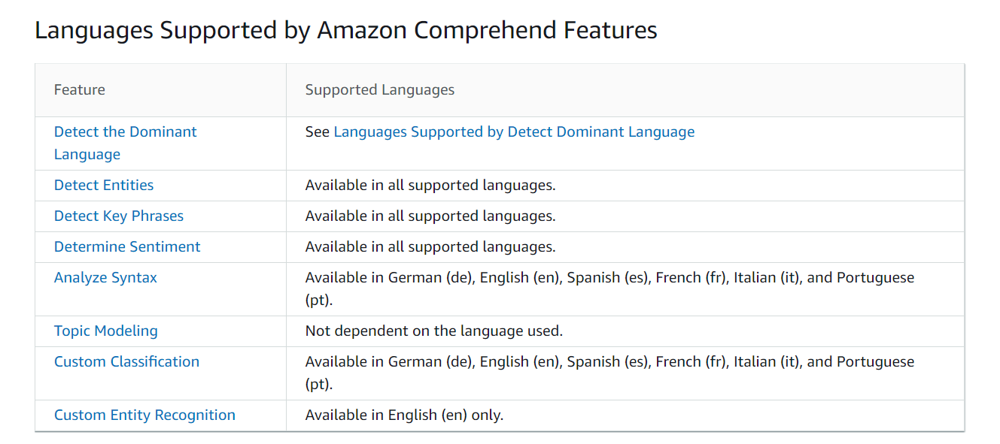
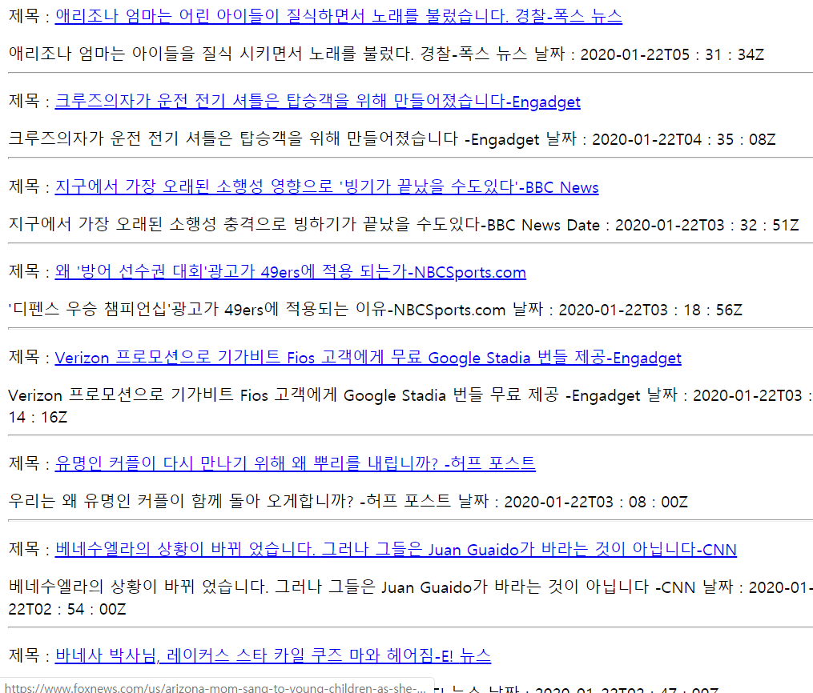

# 개요

AWS Comprehend기초 예제를 사용하기 위한 간편 가이드입니다.

AWS Comprehend 공식문서 의 [API docs](https://docs.aws.amazon.com/comprehend/latest/dg/get-started-api.html)를 참고하여 작성했습니다.

## 지원하는 언어

[Feature별 지원언어 참고](https://docs.aws.amazon.com/comprehend/latest/dg/supported-languages.html), 2019년 11월부터, 대부분의 서비스에서 한국어가 지원됩니다.

## Prerequisite

- **AWS IAM 등록**

  AWS Console에 접속 후, IAM을 사용해 SC, AC

- **AWS CLI 설치**

### Results 
- Hello Comprehend!

  AWS Comprehend를 사용하기 위한 환경을 설정하고, 기초 예제를 수행해봅니다.

- 뉴스 API를 통해 가져온 뉴스 Comprehend 서비스를 통해 기사 내용을 요약해봅시다

  
